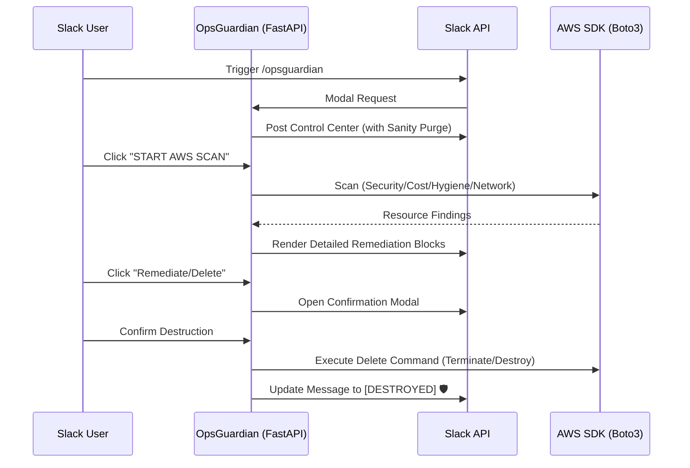

# OpsGuardian 🛡️

> **Slack-native Cloud Governance & Remediation Bot for AWS EKS**

OpsGuardian is a production-grade governance bot designed to run on Amazon EKS. It provides real-time visibility and **one-click remediation / destruction** for AWS security, network, hygiene, and cost-efficiency findings directly from Slack.

---

## 📋 Overview

OpsGuardian acts as an **Active Self-Healing Layer** for your AWS infrastructure. Instead of just "reporting" findings, OpsGuardian empowers your team to investigate and **permanently remediate (Destroy)** resources directly from their Slack channel.

**The Bot's Mission:**
- ✅ **Secure & Block**: Detect and close security holes (Public S3, Open SSH).
- ✅ **Optimize & Reclaim**: Identify and delete wasted resources (Unattached EBS, Unused EIPs).
- ✅ **Govern & Purge**: Enforce resource hygiene (Untagged instances, Stale IAM users).
- ✅ **Remediate in Real-Time**: One-click destruction with a 100% auditable Slack trail.

---

## 🏗️ Architecture

### Infrastructure Architecture (Terraform)
The following diagram describes the multi-tier VPC and EKS layout managed by Terraform.

```text
┌─────────────────────────────────────────────────────┐
│  AWS Cloud (Region: us-east-1)                      │
│  └─ Virtual Private Cloud (VPC)                     │
│     ├─ Public Subnets (NAT Gateway, ALB)            │
│     └─ Private Subnets (EKS Managed Nodes)          │
└─────────────────────────────────────────────────────┘
                        │
                        ↓ (Provisioned via Terraform)
┌─────────────────────────────────────────────────────┐
│  Kubernetes Cluster (AWS EKS)                       │
│                                                     │
│  Helm Addons ─→ ArgoCD, External Secrets Operator    │
│                                                     │
│  Secrets Manager ─→ Stores Slack Tokens             │
│              ↓                                      │
│         OIDC / IRSA Keyless Auth                    │
└─────────────────────────────────────────────────────┘
```

### Identity & Security Model (IRSA)
OpsGuardian implements a **Zero-Secret Architecture** for AWS access. It uses **IAM Roles for Service Accounts (IRSA)**:
- The EKS Pod is tied to a specific Kubernetes `ServiceAccount`.
- This `ServiceAccount` is annotated with a professional IAM Role ARN.
- The Bot assumes this role via **OIDC**, eliminating the need for hardcoded AWS Access Keys.

### Interaction & Remediation Flow

#### 📊 Logical Flow 
```text
[ USER ] -- /opsguardian --> [ SLACK ] -- payload --> [ BOT (FastAPI) ]
                                                            |
    [ SLACK ] <--- render blocks --- [ INVESTIGATION ] <----+
        |                                |
        |--- Click REMEDIATE ------------+-- Boto3 SDK --> [ AWS API ]
                                                            |
    [ SLACK ] <--- update status --- [ RESOURCE DELETED ] <+
```

#### 🧬 Detailed Sequence


### The GitOps Lifecycle
OpsGuardian is fully managed via **ArgoCD**:
- **Application Manifest**: Deployed as an ArgoCD `Application` resource.
- **Sync Strategy**: Automated self-healing ensures the bot's configuration never drifts from Git.
- **Secrets**: Slack tokens are synced from **AWS Secrets Manager** to EKS using the **External Secrets Operator (ESO)**.

---

## 📁 Core Capabilities (Scan & Remediate)

<details>
<summary><b>💰 Cost Optimization & Reclaim (Click to expand)</b></summary>

The bot scans and **actively purges** financial waste:
- **Unattached EBS Volumes**: Finds volumes in `available` state and **Permanently Deletes** them.
- **Unused Elastic IPs**: Identifies and **Releases** EIPs not associated with any instance.
- **Stopped EC2 Instances**: Flags and **Terminates** instances that have been stopped.
</details>

<details>
<summary><b>🛡️ Security Hardening & Enforcement (Click to expand)</b></summary>

Critical security enforcement with one-click fixes:
- **Open SSH (Port 22)**: Detects and **Closes** Security Groups allowing `0.0.0.0/0` on port 22.
- **Public S3 Buckets**: Identifies and **Restricts** buckets with public access enabled.
- **IAM Users without MFA**: Flags and **Suspends/Deletes** users interacting without MFA.
</details>

<details>
<summary><b>🌐 Network Governance (Click to expand)</b></summary>

Scanning the VPC foundation for drift and **Restoring Compliance**:
- **Unused VPCs**: Finds and **Destroys** VPCs with no active dependencies.
- **Unattached Security Groups**: Identifies and **Deletes** SGs not associated with any ENIs.
- **Public IP Subnets**: Flags and **Disables** "Auto-assign Public IP" on exposed subnets.
</details>

<details>
<summary><b>🧹 Resource Hygiene & Cleanup (Click to expand)</b></summary>

Maintaining a clean AWS environment via **Automated Purging**:
- **Untagged Resources**: Finds and **Terminates** EC2 instances missing mandatory tags.
- **S3 Versioning**: Identifies and **Enables/Fixes** buckets where versioning is disabled.
- **Stale IAM Users**: Flags and **Deletes** users who haven't logged in for over 90 days.
</details>

---

## 🛠️ Technical Stack

- **Backend**: Python 3.11 + FastAPI (High-performance async API).
- **Slack Kit**: Slack Bolt SDK with Socket Mode & Block Kit UI.
- **Infrastructure**: Terraform (VPC, EKS, IAM, ArgoCD).
- **Packaging**: Helm 3 (Production-ready charts).
- **Observability**: Real-time Slack feedback & 100% Audit Logging.
- **CI/CD**: GitHub Actions (Linting, Unit Testing, ECR Publishing).

---

## 📁 Repository Structure

```text
ops-guardian/
├── app/                        # FastAPI / Slack Bot logic
│   ├── routers/                # Specialized endpoints (Security, Cost, Hygiene, Network)
│   ├── services/               # Core logic (AWS SDK, Slack Block Kit)
│   └── tests/                  # Pytest verification suite
├── argocd/                     # GitOps Manifests
│   └── application.yaml        # ArgoCD Root Application definition
├── charts/                     # Helm chart for EKS deployment
│   └── opsguardian/
│       ├── templates/          # K8s Manifests (Deployment, ServiceAccount, ESO)
│       └── values.yaml         # Production-ready configuration
├── terraform/                  # Infrastructure as Code (AWS EKS)
│   ├── vpc.tf                  # Networking foundation
│   ├── eks.tf                  # Managed Kubernetes cluster
│   ├── iam.tf                  # IRSA & Remediation IAM Roles
│   └── argocd.tf               # Helm providers for platform controllers
└── .github/workflows/          # CI/CD Automation (ECR Publishing & Testing)
```

---

## 🔄 Deployment Strategy

OpsGuardian follows a **Phased Bootstrapping** approach to solve the "Chicken-and-Egg" problem in EKS:

1.  **Phase 1: Cluster Core**: Terraform provisions the VPC and EKS Cluster.
2.  **Phase 2: Controllers**: Helm releases for **ArgoCD** and **External Secrets** are installed.
3.  **Phase 3: GitOps App**: The ArgoCD `Application` is deployed, which pulls the local Helm chart and starts the Bot.

---

## 🔐 Advanced Secret Management

OpsGuardian never "sees" the Slack tokens in its source code. 
1.  Secrets are stored in **AWS Secrets Manager**.
2.  The **External Secrets Operator** uses the Pod's IAM Role to fetch the values.
3.  ESO creates a native **Kubernetes Secret** in the namespace.
4.  The FastAPI application mounts these secrets as environment variables (`SLACK_BOT_TOKEN`, etc.).

---

## 🧪 Quality Assurance

Every release is validated by a dedicated test suite:
- **`app/tests/test_aws.py`**: Mocks AWS responses to ensure scan logic is 100% accurate.
- **`app/tests/test_slack.py`**: Verifies that the Block Kit UI components are rendered correctly.
- **CI Enforcement**: The GitHub Actions pipeline blocks any deployment if tests fail.

---

## 📚 Additional Resources

*   [Terraform Documentation](https://www.terraform.io/docs)
*   [AWS EKS Best Practices](https://aws.github.io/aws-eks-best-practices/)
*   [Official AWS VPC Module](https://registry.terraform.io/modules/terraform-aws-modules/vpc/aws/latest)
*   [Official AWS EKS Module](https://registry.terraform.io/modules/terraform-aws-modules/eks/aws/latest)
*   [Kubernetes Documentation](https://kubernetes.io/docs/)
*   [ArgoCD Documentation](https://argo-cd.readthedocs.io/)
*   [External Secrets Operator](https://external-secrets.io/)

---
